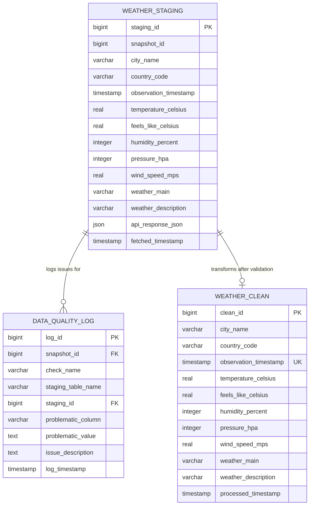

# Data Quality Pipeline Project

This project implements an ETL pipeline to fetch data from an API (e.g. OpenWeatherMap), perform data quality checks using SQL, and load cleansed data into a database.

## Table of Contents
- [Data Quality Pipeline Project](#data-quality-pipeline-project)
- [Database Schema and Relationships](#database-schema-and-relationships)
  - [Entity-Relationship Diagram (Conceptual)](#entity-relationship-diagram-conceptual)
- [Database Setup (MySQL)](#database-setup-mysql)
- [Running the Pipeline](#running-the-pipeline)
  - [Prerequisites](#prerequisites)
  - [Running the Pipeline](#running-the-pipeline-1)
  - [What Happens During the Pipeline Run](#what-happens-during-the-pipeline-run)
  - [Debugging](#debugging)
  - [Notes](#notes)

## Database Schema and Relationships

The database consists of three main tables designed to manage the ETL process and data quality checks:

1.  **`weather_staging`**:
    *   **Purpose**: This table acts as a temporary holding area for raw data fetched directly from the OpenWeatherMap API during each pipeline run. Each run is identified by a `snapshot_id`.
    *   **Key Columns**: `staging_id` (PK), `snapshot_id`, `city_name`, `observation_timestamp`, `temperature_celsius`, `api_response_json`, `fetched_timestamp`.

2.  **`data_quality_log`**:
    *   **Purpose**: Records any data quality issues identified by the SQL checks performed on the `weather_staging` table.
    *   **Key Columns**: `log_id` (PK), `snapshot_id` (links to a specific ETL run), `check_name`, `staging_id` (links to the specific problematic record in `weather_staging`), `issue_description`.

3.  **`weather_clean`**:
    *   **Purpose**: Stores the final, validated, and cleansed weather data. This table is populated after data from `weather_staging` passes all quality checks.
    *   **Key Columns**: `clean_id` (PK), `city_name`, `observation_timestamp`, `temperature_celsius`, `processed_timestamp`.
    *   **Unique Constraint**: `(city_name, observation_timestamp)` ensures that only one clean record exists for a given city at a specific observation time.

### Entity-Relationship Diagram



**Key Relationships:**

*   **`weather_staging` to `data_quality_log`**:
    *   A `snapshot_id` from `weather_staging` can be associated with multiple entries in `data_quality_log`, indicating all issues found within that specific ETL run.
    *   A `staging_id` from `weather_staging` (representing a single raw API record) can also be linked to multiple entries in `data_quality_log` if that specific record fails several distinct quality checks.
    *   This is effectively a one-to-many relationship where one staging snapshot (or one staging record) can have many quality log entries.

*   **`weather_staging` to `weather_clean`**:
    *   This is primarily a **data transformation and loading relationship**. Clean data in `weather_clean` is derived from records in `weather_staging` that have passed all data quality checks.
    *   The `INSERT ... SELECT ... ON DUPLICATE KEY UPDATE` mechanism ensures that `weather_clean` maintains the latest valid observation for each `city_name` and `observation_timestamp`.

## Database Setup (MySQL)

Before running the Python pipeline, you need to create the necessary database tables using the `schema.sql` file.

**Prerequisite:** Ensure you have MySQL installed and running, and that you have created the target database (e.g., `weather`).

You can execute the schema setup script in two ways:

**Method 1: Using the Command Prompt / Terminal**

This is the recommended way for initial setup.

1.  Open your Windows Command Prompt, PowerShell, or other terminal.
2.  Navigate to your project directory (optional, but helps with relative paths if needed).
3.  Run the following command, replacing placeholders with your actual MySQL connection details:

    ```bash
    mysql -h <your_host> -u <your_user> -p <your_database_name> < database/schema.sql
    ```

    *   `<your_host>`: Hostname or IP address of your MySQL server (e.g., `localhost`).
    *   `<your_user>`: Your MySQL username (e.g., `george`).
    *   `<your_database_name>`: The name of the database you created (e.g., `weather`).
    *   `-p`: This flag will prompt you to enter the password securely.
    *   `< database/schema.sql`: This redirects the content of the schema file into the `mysql` command.

    **Example:**

    ```bash
    mysql -h localhost -u george -p weather < database/schema.sql
    ```

4.  Enter your MySQL password when prompted. The tables defined in `schema.sql` will be created in the `weather` database.

**Method 2: Inside the MySQL Interactive Prompt**

You can also run the script after connecting to MySQL manually.

1.  Connect to your MySQL server using the command-line client:

    ```bash
    mysql -h <your_host> -u <your_user> -p
    ```
    *(Enter password when prompted)*

2.  Once connected (you'll see the `mysql>` prompt), select the target database:

    ```sql
    USE <your_database_name>;
    ```
    **Example:**
    ```sql
    USE weather;
    ```

3.  Execute the schema file using the `source` command. Use forward slashes `/` in the path, even on Windows:

    ```sql
    source path/to/your/project/database/schema.sql;
    ```
    **Example (assuming your command prompt is open in `s:\Learning\property`):**
    ```sql
    source database/schema.sql;
    ```
    **Example (using absolute path):**
    ```sql
    source s:/Learning/property/database/schema.sql;
    ```

This will execute the SQL commands within the file against the selected database (`weather`).


## Running the Pipeline

This section explains how to run the ETL pipeline, which consists of the following steps:
1. **Extract**: Fetch weather data from the OpenWeatherMap API and load it into the `weather_staging` table.
2. **Transform & Load**: Perform data quality checks and load valid data into the `weather_clean` table.

### Prerequisites
Before running the pipeline, ensure the following:
1. **Environment Variables**:
   - Create a `.env` file in the root directory of the project (if not already present).
   - Add the following variables to the `.env` file:
     ```
     DB_HOST=localhost
     DB_PORT=3306
     DB_NAME=weather
     DB_USER=<your_mysql_username>
     DB_PASSWORD=<your_mysql_password>
     OPENWEATHERMAP_API_KEY=<your_openweathermap_api_key>
     ```
   - Replace `<your_mysql_username>`, `<your_mysql_password>`, and `<your_openweathermap_api_key>` with your actual credentials.

2. **Install Dependencies**:
   - Install the required Python libraries using `pip`:
     ```bash
     pip install -r requirements.txt
     ```

3. **Database Setup**:
   - Ensure the database schema is created by running the `schema.sql` file. Refer to the **Database Setup** section above for instructions.

### Running the Pipeline
To run the pipeline, execute the `main.py` script. This script orchestrates the ETL process by calling the `extract` and `transform_load` modules.

1. Open a terminal or command prompt.
2. Run the pipeline:
   ```bash
   python src\main.py
   ```

### What Happens During the Pipeline Run
1. **Extraction**:
   - The pipeline fetches weather data for the cities listed in the `TARGET_CITIES` variable in `extract.py`.
   - Each run generates a unique `snapshot_id` to track the data.
   - The raw data is inserted into the `weather_staging` table.

2. **Transformation & Load**:
   - The pipeline executes SQL commands from `quality_checks.sql` to:
     - Log data quality issues in the `data_quality_log` table.
     - Insert valid data into the `weather_clean` table.
   - The pipeline logs how many rows were added to each table.


### Debugging
- If the pipeline fails, check the logs for error messages.
- Common issues include:
  - Missing or invalid API key.
  - Database connection issues.
  - Data quality issues logged in the `data_quality_log` table.

### Notes
- You can modify the list of target cities in the `TARGET_CITIES` variable in `extract.py`.
- The pipeline is designed to be idempotent, meaning you can safely re-run it without duplicating data in the `weather_clean` table.
